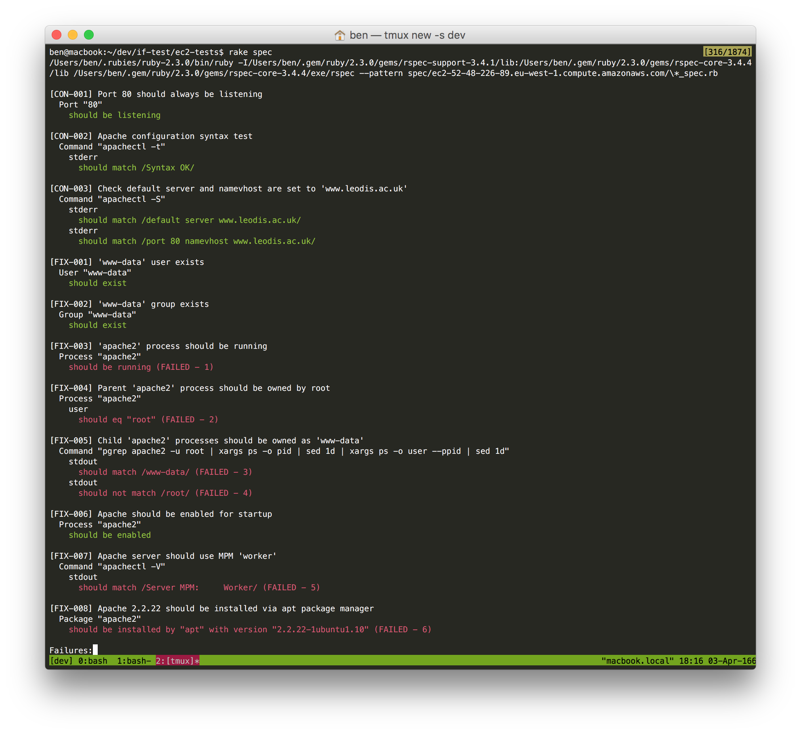

# Technical Test - Ben McRae

Steps of workflow / implementation.

1. Exploratory testing of server and Apache installation / configuration.
2. Identify implementation strategies.
3. Write ServerSpec tests for conformity and convergence.
4. Technical implementation.

## 1. Exploratory testing

Ubuntu Precise 12.04 LTS machine with Apache 2.2.4 installed from source.

```
root@ip-172-31-45-119:/opt/apache/bin# ./apachectl -V
Server version: Apache/2.2.4 (Unix)
Server built:   Dec  7 2015 14:14:15
Server's Module Magic Number: 20051115:4
Server loaded:  APR 1.2.8, APR-Util 1.2.8
Compiled using: APR 1.2.8, APR-Util 1.2.8
Architecture:   64-bit
Server MPM:     Prefork
  threaded:     no
    forked:     yes (variable process count)
Server compiled with....
 -D BIG_SECURITY_HOLE
 -D APACHE_MPM_DIR="server/mpm/prefork"
 -D APR_HAS_SENDFILE
 -D APR_HAS_MMAP
 -D APR_HAVE_IPV6 (IPv4-mapped addresses enabled)
 -D APR_USE_SYSVSEM_SERIALIZE
 -D APR_USE_PTHREAD_SERIALIZE
 -D APR_HAS_OTHER_CHILD
 -D AP_HAVE_RELIABLE_PIPED_LOGS
 -D DYNAMIC_MODULE_LIMIT=128
 -D HTTPD_ROOT="/opt/apache"
 -D SUEXEC_BIN="/opt/apache/bin/suexec"
 -D DEFAULT_PIDLOG="logs/httpd.pid"
 -D DEFAULT_SCOREBOARD="logs/apache_runtime_status"
 -D DEFAULT_LOCKFILE="logs/accept.lock"
 -D DEFAULT_ERRORLOG="logs/error_log"
 -D AP_TYPES_CONFIG_FILE="conf/mime.types"
 -D SERVER_CONFIG_FILE="conf/httpd.conf"
```

A few observations from this...

* This is an old version of Apache from 2007.

* Was curious about 'BIG_SECURITY_HOLE'. A quick Google search came back with 'Apache has not been designed to serve pages while running as root', suggesting that BIG_SECURITY_HOLE is not necessary if we change the Apache config user to a non 'root' user.

* The server installation has been compiled the with following *static* extensions - I found the modules by looking at `./apachectl -M` and comparing with the `./configure --help` documentation (on an ubuntu/precise64 Vagrant box). Adding the modules statically via compilation allows faster execution time than enabling the modules through DSO. Static compilation also installs the whole module set which may not be needed (best practices are to install only the required modules used).
```
./configure --prefix /opt/apache /
--enable-so /
--enable-rewrite /
--enable-proxy /
--enable-vhost-alias /
--enable-cache /
--enable-dav /
--enable-disk-cache /
--enable-headers /
--enable-expires /
--enable-dav-lock
```

* The server has been setup to use the 'prefork' MPM (incurs threading to be turned off). Since the website is served through the proxy module, we could use either the 'worker' or 'event' (apache 2.4+) MPM which gives better concurrency via child processes and threading.

##2. Implementation strategies

I have identified 2 potential implementations for managing Apache. I will discuss the pros and cons for each approach.

1. **Keep existing Apache installation** - which has been installed from source. Run a configuration management tool to implement any desired fixes discovered from exploratory testing.
  * **PRO:** Can install modules statically, this has marginally better performance.
  * **CON:** It can be dangerous to converge an application which has been installed outside of a configuration management tool and subject to entropy.
  * **CON:** When installing from source, to achieve idempotency will require more work.
  * **CON:** Unable to make full use of existing configuration management tools which will lead to more complexity in setup scripts.

2. **Install Apache through a package manager** - remove old source installation. This will install the latest (pinned) Apache from the 'apt' package manager.
  * **PRO:** The apache binaries will have more thorough testing for the particular OS installation (Ubuntu 12.04 LTS).
  * **PRO:** Security patches will be easier to obtain and apply.
  * **PRO:** Additional tools provided such as a2enmod to manage DSO modules.
  * **PRO:** Fresh install of Apache - no entropy.
  * **CON:** More difficult to statically add modules, if necessary.
  * **CON:** Will need to diff existing configuration scripts to make sure we don't lose any configuration settings.
  * **CON:** Will require additional scripts to stop and remove existing apache installation.

### Decision

I have decided to go with second implementation - **Install Apache through a package manager**. The main reasons are due to fresh install of apache - no entropy, better tools to support idempotency, easier to build and roll out new machines.

## 3. ServerSpec tests

  Define some conformity tests to ensure we don't deviate from expected behaviour during upgrades or idempotency tests. These tests should **ALWAYS** pass / run green.

  * **[CON-001]** Port 80 should always be listening
  * **[CON-002]** Apache configuration syntax test
  * **[CON-003]** Check default server and namevhost are set to 'www.leodis.ac.uk'

  Below are the tests I have written based on the selection of the second implementation - **Install Apache through a package manager**. The idea is to turn these tests green!

  * **[FIX-001]** 'www-data' user exists
  * **[FIX-002]** 'www-data' group exists
  * **[FIX-003]** 'apache2' process should be running
  * **[FIX-004]** Parent 'apache2' process should be owned by root
  * **[FIX-005]** Child 'apache2' processes should be owned as 'www-data'
  * **[FIX-006]** Apache should be enabled for startup
  * **[FIX-007]** Apache server should use MPM 'worker'
  * **[FIX-008]** Apache 2.2.22 should be installed via apt package manager

  ### Run ServerSpec tests

  If you want to run the ServerSpec tests locally, there are some environment prerequisites.

  1. Local Ruby installation (I currently run Ruby 2.3.0).
  2. Installation of bundler gem (`gem install bundler`).
  3. Run `bundle install` in project directory - if the gem dependencies fail, delete the `Gemfile.lock` and run install again.

  Before executing tests, make sure you have the server private key added to your authentication agent `ssh-add path_to_private_key.pem`. Then off you go...

  1. `cd ec2-tests`
  2. `rake spec`



## 4. Technical Implementation
